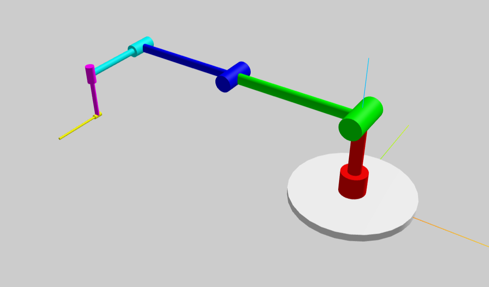

# KinematicsGenerator

This script allows to generate multiple useful tools for robots from a simple Denavit-Hartenberg parameters table. The motivation of the project comes for the need of computing Forward Kinematics and jacobian functions for Real Time applications in C code, and to create quick simulation models for ROS or Unity by computing its URDF file.

## Installation

To install the KinematicsGenerator script, follow these steps:

1. Clone the repository:
    ```sh
    git clone https://github.com/gmescudero/KinematicsGenerator.git
    ```
1. Navigate to the project directory:
    ```sh
    cd KinematicsGenerator
    ```
1. Install the required dependencies:
    ```sh
    pip install -r requirements.txt
    ```

## Basic Usage

To use the KinematicsGenerator script, follow these steps:

1. Prepare a Denavit-Hartenberg parameters table in a CSV file. The included example in file `example_UR3e.csv` may be used as template. It comes from the [UR3e DH table in the Universal Robots page](
    https://www.universal-robots.com/articles/ur/application-installation/dh-parameters-for-calculations-of-kinematics-and-dynamics/).
2. Run the script with the path to your CSV file as an argument:
    ```sh
    python kinematics_generator.py example_UR3.csv
    ```
3. The script will generate a kinematics model and, from that, it will create:
    - A `.c` file containing:
        - The direct kinematics function.
        - The analyithical jacobians for the whole robot and splited in position and orientation.
        - The geometrical jacobian for speed calculations
    - A *URDF* file with a basic model automatically built with cylinders for rotational joints and prisms for prismatic ones. The colors of each one indicate the order of the links, it being: Red, Green, Blue, Cyan, Magenta, Yelow, Black, and over again. In the below image it can be found the *URDF* outcome generated by the script from the given example.
    
        

For more detailed usage and options, refer to the script's help:
```sh
python kinematics_generator.py --help
```